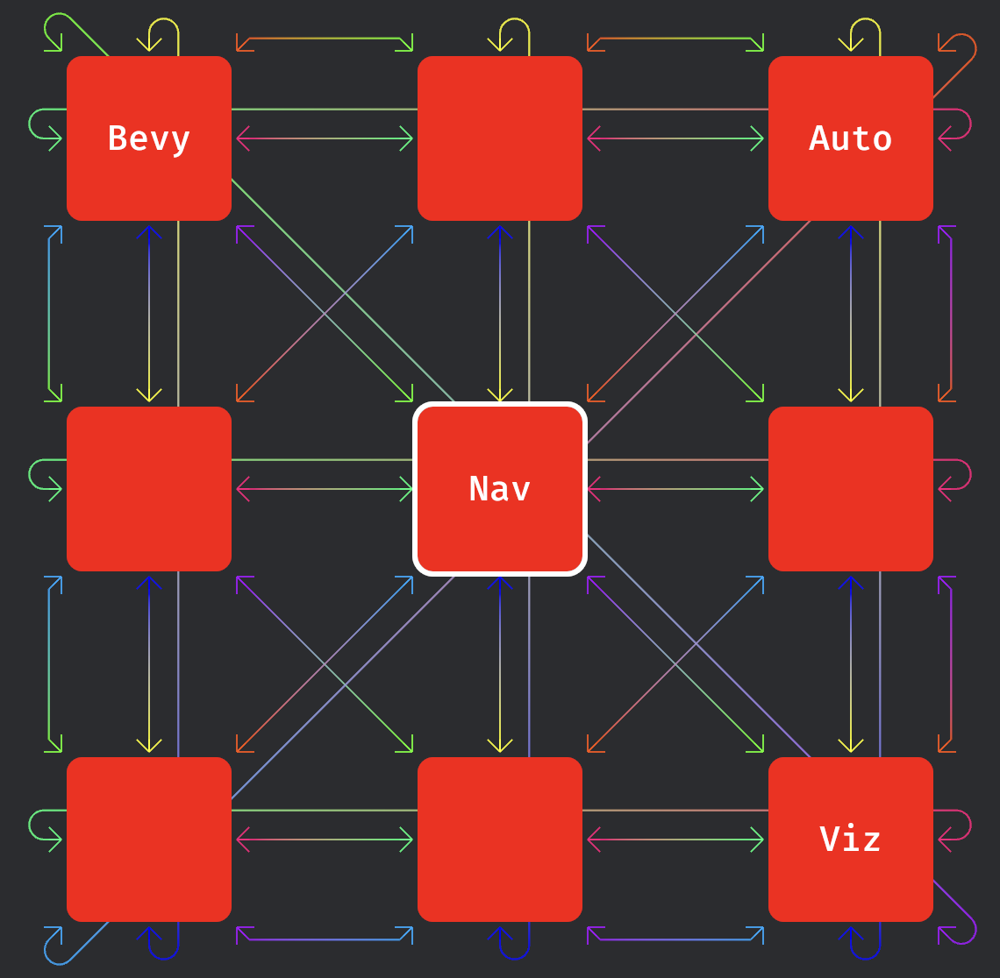

# 

A Bevy Plugin that draws a visualization of the auto directional navigation system in Bevy's UI Framework.

## Usage
Simply add the `AutoNavVizPlugin` plugin to your app that has auto
directional navigation set up.

```rust
fn main() {
    App::new()
        .add_plugins((
            DefaultPlugins,
            InputDispatchPlugin, // Needed for input focus
            DirectionalNavigationPlugin, // Needed for auto directional nav
            AutoNavVizPlugin // Add this plugin
        ))
        .run();
}
```

Once you have set the `InputFocus` in the app
to a UI entity with the `AutoDirectionalNavigation` component, the `AutoNavVizPlugin`
will draw the navigation edges that exist with all other UI entities in the
same render target that have also opted in to `AutoDirectionalNavigation`.

## Configuration
The plugin can be configured via its gizmo config group `AutoNavVizGizmoConfigGroup`.

``` rust
fn setup(mut config_store: ResMut<GizmoConfigStore>) {
    let mut config = config_store.config_mut::<AutoNavVizGizmoConfigGroup>().1;
    // e.g.
    config.draw_mode = AutoNavVizDrawMode::EnabledForCurrentFocus;
}
```

Refer to the docs for [`AutoNavVizGizmoConfigGroup`](https://docs.rs/bevy_auto_nav_viz/latest/bevy_auto_nav_viz/struct.AutoNavVizGizmoConfigGroup.html) for all of
the settings that can be changed. Check out the [settings](examples/settings.rs) example to see them in action.

## Examples

### [settings](examples/settings.rs) 
An example showcasing the different settings of the `AutoNavVizPlugin`
available for customizing via the `AutoNavVizGizmoConfigGroup`. Use this to figure out what settings you prefer for your use case.

### [moving_button](examples/moving_button.rs)
An example showcasing what the visualization looks like with various
placement of buttons through the use of a moving button.
Use this to see what the visualization will look like (and, by extension,
how the `AutoDirectionalNavigator` will behave) for more
unusual / freeform placements of buttons.

## Version Table

| Bevy    | BANV      |
| ------- | --------- |
| 0.18    | 0.1       |

## Limitations
This crate has some limitations (accurate as of March 2026)
- It does not nicely/clearly visualize navigation between UI nodes that overlap.
- Only entities that are in the same render target as the current focus have
navigation edges visualized.
- Probably others not yet reported!

If there is a limitation you would like addressed, file a [GitHub Issue](https://github.com/kfc35/bevy_auto_nav_viz/issues).

## License
This project is dual-licensed under
- MIT License ([LICENSE-MIT](LICENSE-MIT) or https://opensource.org/license/MIT)
- Apache License Version 2.0 ([LICENSE-APACHE](LICENSE-APACHE) or https://www.apache.org/licenses/LICENSE-2.0)

at your discretion.

## Contributing
Code contributions are welcome. Unless you explicitly state otherwise, any contribution intentionally submitted for inclusion in the project by you, as defined in the Apache-2.0 license, shall be dual licensed as above, without any additional terms or conditions.

No AI contributions allowed.
